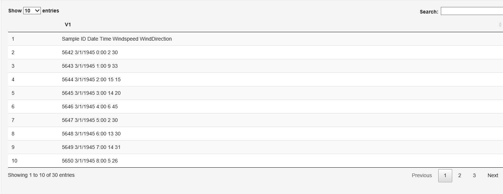
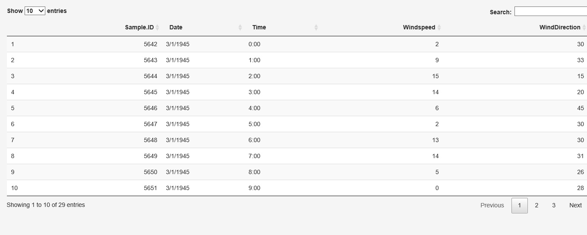

```{r setup, include = FALSE}
knitr::opts_chunk$set(
  collapse = TRUE,
  comment = "#>"
)
```

```{r child = "EPA_Disclaimer.Rmd", echo = FALSE, comment = NA}
```
# untidywindrose vignette
## Introduction

A wind rose is a graphical representation of the distribution of wind speed  and wind direction at a location. Wind roses  are useful for the assessment of air pollution measurements and are a useful tool for air pollution scientists. Untidywindrose is a  basic web application that can be used to create wind roses  from text-based  tabular data files that makes producing wind roses  relatively simple and straightforward. All that is required is a text-based,  delimited tabular data file which contains columnar measurements representing wind speed  and wind direction. Untidywindrose allows the user to select which column of data represents both wind speed  and wind direction from the data file, and subsequently creates and displays a wind rose.  . The user is then given the option to download the newly created wind rose, all without having to install any software or having to learn a new programming language.


<!-- Vignettes are long form documentation commonly included in packages. Because they are part of the distribution of the package, they need to be as compact as possible. The `html_vignette` output type provides a custom style sheet (and tweaks some options) to ensure that the resulting html is as small as possible. The `html_vignette` format: -->

<!-- - Never uses retina figures -->
<!-- - Has a smaller default figure size -->
<!-- - Uses a custom CSS stylesheet instead of the default Twitter Bootstrap style -->


## Install the development version of Untidywindrose

If you do not have the remotes package installed, install it now

> install.packages("remotes", dependencies = TRUE)

next install the development version of untidywindrose.

```R
remotes::install_github(repo = "USEEPA/untidywindrose",
                        dependencies = TRUE,
                        upgrade = "always",
                        build = TRUE
                        #optional, if you want the manual
                        build_manual = TRUE,
                        #optional, if you want the vignette
                        build_vignettes = TRUE
                        )
```

## attach the package then run untidywindrose()
> library(untidywindrose)
  untidywindrose::utwr()

## Usage
The start-up screen will display once the applet has been loaded with a standard web browser. First, upload a file containing wind speed and wind direction data using the “Browse…” button under “select a file” on the left side of the screen. Here you will choose the delimited, plain-text file containing  the data  to be plotted into a wind rose .
After selecting the file, a blue progress bar underneath the “Browse…” button will appear and quickly scroll over to the right and display “Upload complete” indicating that the file was successfully uploaded.
Underneath the “select a file” option is a numeric input box  labeled “Ignore first N rows”. This option allows the user to specify if there are any leading rows of data that the app should not interpret as data. This could be used for  cases where the data file contains header information that should be ignored and not treated as data.
Next is the Boolean drop down  menu labeled “Does this file contain a header?” This option allows the user to specify if the first row of data after “Ignore first N rows” should be treated as header information which will be used as labels to identify the imported data. Select True or false. If false,  the applet will automatically generate column names in the format of “$V_1$”, “$V_2$”, “$V_3$”,…,“$V_n$”, where n is the number of columns in the dataset.
The “Transpose the data” Boolean drop down  menu gives the user the option of manipulating the imported data in a way such that the columns and the rows are interposed with each other so that a wind rose  can be generated. The wind speed and the wind direction must be entered in columnar form. This option allows the user to transform the data where variables are arranged in rows to an arrangement where the variables are arranged in columns (tidy).  Data retrieved from SQL or JSON containers are often arranged by columns, this option allows the user to easily transpose the data without manual manipulation.
The “File delimiter” selection allows the user to specify which character will be used as the delimiter for separating columns of data so that the applet can properly import the data. Common delimiter options of tab (“/t”), comma (“,”), semicolon (“;”), bar (“|”), and space (“ “) are given as options. If another ASCII character is used as a delimiter the option “other delimiter” is available for user selection. If this option is chosen a pop-up text box will appear where the user can input another character that will be used as the character delimiter for importing the file. The delimiter is the ASCII  character that is used to tell the applet where the bounds of one column of data are located. All data in between two delimiters is treated as one single object. If no delimiter is present the applet will treat the data as one single column of data. Multiple successive delimiters will be treated as one delimiter.
After the above options are set properly and the file has been uploaded, the user can then select the “Submit” button  which will display the data in a tabular format on the right side  panel. This data table should be inspected by the user to ensure that the data has been properly imported  before continuing. If more data exists than  can be displayed on the screen a horizontal scroll bar will appear to allow the user to scroll though the columns of data, also the data may appear over multiple pages if there  are too many rows of data that can be fit onto the screen. The user should make sure that no error messages (red print) has appeared and that the data is arranged in well-defined columns. If the “Does this file contain a header” option was selected to be “TRUE” the user should ensure that each column has imported column labels properly for each row. If instead “False” was selected the user should ensure that each column has an automatically generated column name in the form of “$V_1$”, “$V_2$”, “$V_3$”,…,”$V_n$”. If the table  displays data that has not been properly formatted the above options can be altered until the table  displays the correct information. Rarely, upon receiving certain error messages  the user will need to restart the entire process if the web page does not respond, usually simply changing the options above, the user will see an immediate effect. 
Also,  after the “Submit” button has been depressed,  three input selection boxes and a button labeled “Display Plot” should appear.
The first Input selection is labeled “which column represents windspeed?”. Here the user should select the column name of the data that represents winds peed  data.
The next input selection is labeled “Which column represents wind direction?”. Here the user should select the column name of the data that represents the wind direction data.
The third new input selection is labeled “plot output extension?” where the user can select the file format of the output file. The options are “png”, “bmp”, “jpeg”, “tiff”, “eps”, “pdf”, and “ps”.
The next input selection, labeled “Number of Windspeed intervals ”, represents the windspeed interval. The default is 2 units but for data representing low mean wind speeds a value of 1 or 0.5 may be better.
The next text input is labeled “Units” where the user can type in the optional wind speed units. This will simply add text to the wind rose  plot that will communicate to the reader of the wind rose  the units of measure that was used to quantify wind speed measurements.
Once the user has completed all the above steps a button labeled “Display Plot” will appear on the left side panel . This will display a wind rose  graph under the data table on the right side panel  using the data that was imported with the options provided by the user. The user should inspect the resulting graph ensuring that it represents the data selected as desired.
:  Inspect the wind rose and make any necessary adjustments.  The user will notice a “download plot” button on the bottom left side. If the user finds the wind rose  satisfactory, the user can then select the “Download Plot” button  that will allow the user to download the wind rose in a desired format chosen in the “plot output extension” input option.

If the user attempts to upload this data to untidywindrose using comma as the delimiter and “Does the file contain a header?” set to FALSE the data will display like this:

In the above picture the user can see that the data has not been imported properly since the five columns of data was interpreted as one single column of data which has been labeled “V1”. Also note that the first row should have been used as a header to label the columns and not interpreted as data.
If the user were to set the delimiter to “tab(”/t“)” with the option “Does the file contain a header?” set to TRUE the right-side panel’s data table will look like this:
In the above picture each of the 5 imported columns have been properly separated. Also, each column has labels that were imported from the header row.
The user can now proceed to “Display Plot” after verifying that the data was properly imported and selecting the proper column labels for the options "Which column represents wind speed ?" and “which column represents wind direction?” and selecting “plot output extension?”, “Number of Wind speed  intervals” then typing in the “units”. For this example, the user selects the column labeled “Wind speed”, “Wind direction ” and “png” “5” and “mi/hr” for each, respectively.
After selecting the “plot output extension” of the user’s choice a wind rose  plot is generated below the data table on the right side panel  for user inspection.

After inspecting the wind rose  and making any necessary adjustments. A button labeled “Download plot” will appear on the bottom-left side panel . If the user finds the wind rose  satisfactory, the user can then select the “Download Plot” button  that will allow the user to download the wind rose
in the output format chosen in the “plot output extension?” input selection.


## Example Usage
A user has the following data in a tab delimited text file.
```{r, echo=FALSE}
sampledata <- read.table("sampledata.txt",header = T, sep = "\t")
knitr::kable(sampledata, caption="Sample windrose data")
```

If the user attempts to upload this data to untidywindrose using comma as the delimiter and "Does the file contain a header?" set to FALSE the data will display like this:

<center></center>

In the above picture the user can see that the data has not been imported properly since the five columns of data was interpreted as one single column of data which has been labeled "V1".  Also note that the first row should have been used as a header to label the columns and not interpreted as data.

If the user were to set the delimiter to "tab("/t")" with the option "Does the file contain a header?" set to TRUE the right-side panel's data table will look like this:

<center></center>

In the above picture each of the 5 imported columns have been properly separated. Also, each column has labels that were imported from the header row.

The user can now proceed to "Display Plot" after verifying that the data was properly imported and selecting the proper column labels for the options 'Which column represents windspeed?" and "which column represents wind direction?" and selecting "plot output extension?", "Number of Windspeed intervals" then typing in the "units".  For this example, the user selects the column labeled "Windspeed", "WindDirection" and "png" "5" and "mi/hr" for each, respectively.

After selecting the "plot output extension" of the user's choice a windrose plot is generated below the data table on the right-side panel for user inspection.

```{r,echo=FALSE, fig.width=5, fig.align = "center", message=F, warning=F}
require(openair)
cbPalette <- c("#999999", "#E69F00", "#56B4E9",  #colorbild safer pallette
                "#009E73", "#F0E442", "#0072B2", "#D55E00", "#CC79A7")
openair::windRose(sampledata,
                  ws = "Windspeed",
                  auto.text = T,
                  wd = "WindDirection",
                  cols = cbPalette,
                  paddle = T,
                  statistic = "prop.count",
                  annotate  = T,
                  key.position = "right",
                  #breaks = c(0.5, 3, 10, 15),
                  #ws.int = 5,
                  key.footer = "mi/hr")
```

After inspecting the windrose and making any necessary adjustments. A button labeled “Download plot” will appear on the bottom left side panel. If the user finds the windrose satisfactory, the user can then select the “Download Plot” button which will cause the web browser that is used to view the page to allow the user to download the windrose in the output format chosen in the “plot output extension?” input selection.
